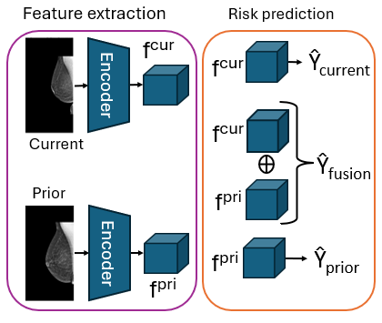
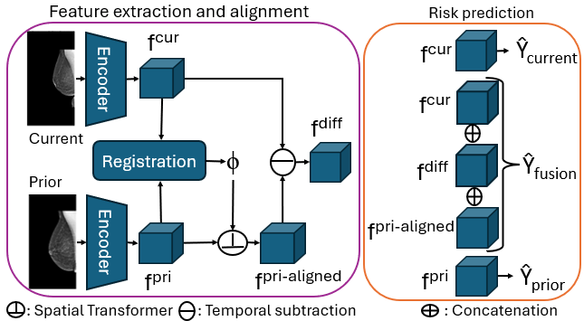
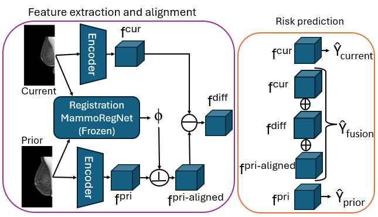
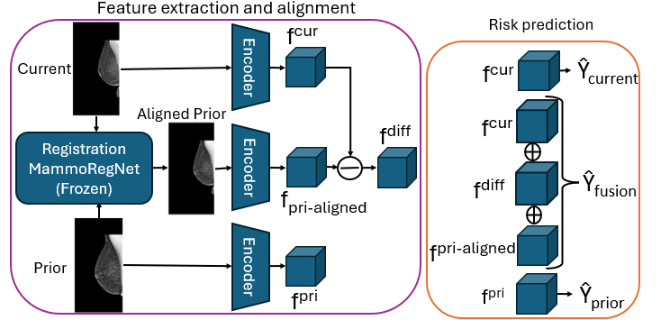
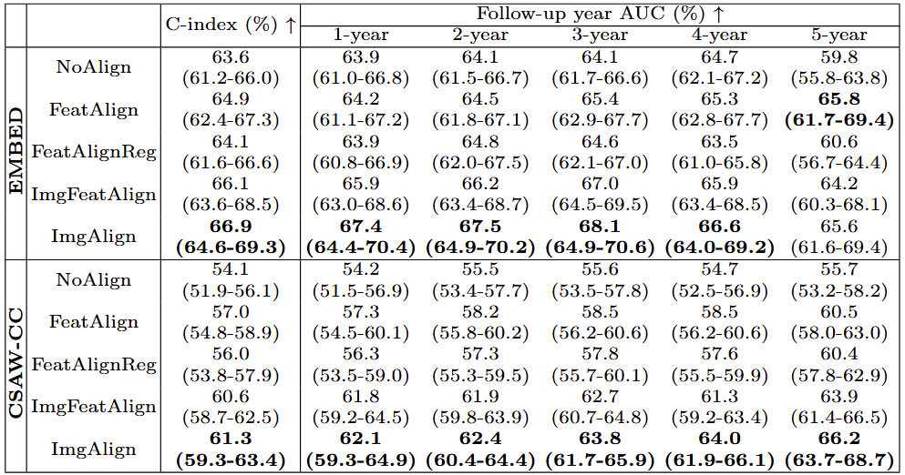
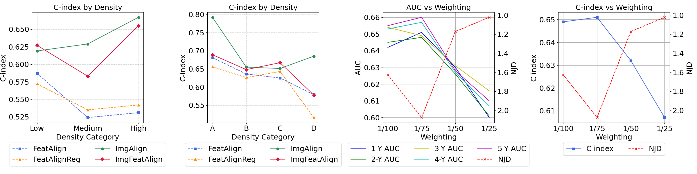

# Reconsidering Explicit Longitudinal Mammography Alignment for Enhanced Breast Cancer Risk Prediction
This is the code for our MICCAI 2025 paper. For more details, please refer to our paper.

## Table of Contents
1. [Introduction](#introduction)
2. [Method](#method)
3. [Datasets](#datasets)
4. [Results / Key findings of the paper](#results--key-findings-of-the-paper)
5. [Reproduction of the results](#reproduction-of-the-results)
6. [Citation](#citation)
## Introduction
Risk prediction estimates the probability of developing breast cancer within a
specified time frame, focusing on a 5-year period following a specific mammogram. However, effective use of longitudinal mammograms requires precise spatial alignment or registration, as misalignment
can obscure abnormalities and distort risk assessments. This is challenging due  to the non-rigid nature of breast tissue and variations in breast compression
during examinations. To address the lack of insights into the choice of alignment, this study aims to
evaluate explicit alignment strategies for longitudinal mammography and their
impact on risk prediction. We examine whether alignment should occur at the
image or feature level. To facilitate efficient image level alignment, we introduce MammoRegNet, the first deep learning-based image registration model for aligning longitudinal mammography images.

## Method
We compare different explicit alignment strategies to assess their impact on risk prediction performance

  **1) NoAlign:** Direct feature extraction without alignment

  **2) FeatAlign:** Feature-level alignment (jointly training of alignment and risk prediction)
  
  **3) FeatAlignReg:** Similar to FeatAlign, we only extend the alignment Loss with a regularization loss

  **4) ImgAlign:** Image-level alignment with MammoRegNet (pretrained MammoRegNet)
  
  **5) ImgFeatAlign:** Applying MammoRegNet’s deformation field in feature space (pretrained MammoRegNet)


<div align="center">
  <table>
    <tr>
      <td align="center">
        <br>
        <em>(a) NoAlign</em>
      </td>
      <td align="center">
        <br>
        <em>(b) FeatAlign</em>
      </td>
    </tr>
    <tr>
      <td align="center">
        <br>
        <em>(c) ImgAlign</em>
      </td>
      <td align="center">
        <br>
        <em>(d) ImgFeatAlign</em>
      </td>
    </tr>
  </table>
</div>

## Datasets
We used two wo large, publicly available mammography datasets :
- **Emory Breast Imaging Dataset (EMBED)**: https://aws.amazon.com/marketplace/pp/prodview-unw4li5rkivs2#overview}
- **Cohort of Screen-Aged Women Case Control (CSAW-CC)**: https://snd.se/en/catalogue/dataset/2021-204-1

## Results / Key findings of the paper
**Effect of Feature- vs. Image-Level Alignment on Risk Prediction**: 
- We assess the impact of feature-level and image-level alignment on risk prediction
performance

  → Image-level alignment is superior to representation-level alignment leading to better risk prediction performance

<p align="center">
  
</p>
<p align="center">
  <em>1–5 Year Breast Cancer Risk Prediction of different alignment methods: C-index and AUC with 95% CI in parentheses.</em>
</p>

**In-Depth Analysis of Weighting and Alignment**:
- We further explore how different weightings of the alignment loss in the jointly training of feature alignment and risk prediction (in FeatAling) affect risk prediction performance 

    → Increasing the alignment weight improves deformation field quality by reducing negative Jacobian determinants but decreases risk prediction performance.  This shows that there is a trade-off between alignment quality and predictive performance

- We also evaluate feature-level and image-level alignment across  breast density categories
    
    → Image-level alignment (ImgAlign) performs best across the different density categories especially for dense breast tissue

<p align="center">
  
</p>
<p align="center">
  <em>Analysis of Weighting and Alignment</em>
</p>


## Reproduction of the results
For reproducing the results follow the instructions below:

**Important**: for each script in the `scripts` folder, make sure you update the paths to load the correct datasets and export the results in your favorite directory.

### 1) Requirements
Requirements are in the requirements.txt file

### 2) Pre-processing of the datasets
The preprocessing step ensures that the datasets are properly prepared before training.

The `preprocessing` folder contains  the necessary scripts to preprocess images and split the datasets into training, validation and test.

To preprocess the EMBED dataset, use: `preprocessing/preprocess_img_embed.py`

To preprocess the CSAW-CC dataset, use: `preprocessing/preprocess_img_csaw_cc.py`

To split both datasets into training, validation, and test sets, use: `preprocessing/split_data.py`

For the risk prediction, create a CSV file describing your dataset by running the notebooks in the `notebooks` folder

### 3) Training 
#### 3.1) MammoRegNet
For training MammoRegNet run `scripts/train_MammoRegNet.sh`

#### 3.2) Risk prediction models
For training the risk prediction models run `scripts/train_risk_NoAlign.sh`, `scripts/train_risk_FeatAlign.sh`, `scripts/train_risk_FeatAlignReg.sh`, `scripts/train_risk_ImgAlign.sh`, and `scripts/train_risk_ImgFeatAlign.sh`

### 4) Inference 
#### 4.1) MammoRegNet
Run `scripts/test_MammoRegNet.sh`

#### 4.2) Risk prediction models
Run `scripts/test_risk_NoAlign.sh`, `scripts/test_risk_FeatAlign.sh`, `scripts/test_risk_FeatAlignReg.sh`, `scripts/test_risk_ImgAlign.sh`, and `scripts/test_risk_ImgFeatAlign.sh`


 

## Citation
If you use this code or models in your scientific work, please kindly cite our paper: 
```bibtex
@inproceedings{,
  title={Reconsidering Explicit Longitudinal Mammography Alignment for Enhanced Breast Cancer Risk Prediction},
  author={Thrun, Solveig and Hansen, Stine and Sun, Zijun and Blum, Nele and Salahuddin A., Suaiba  and Wickstrøm, Kristoffer and Wetzer, Elisabeth and Jenssen, Robert and Stille, Maik and Kampffmeyer, Michael},
  booktitle={International Conference on Medical Image Computing and Computer-Assisted Intervention},
  pages={ },
  year={2025},
  organization={Springer}
}
